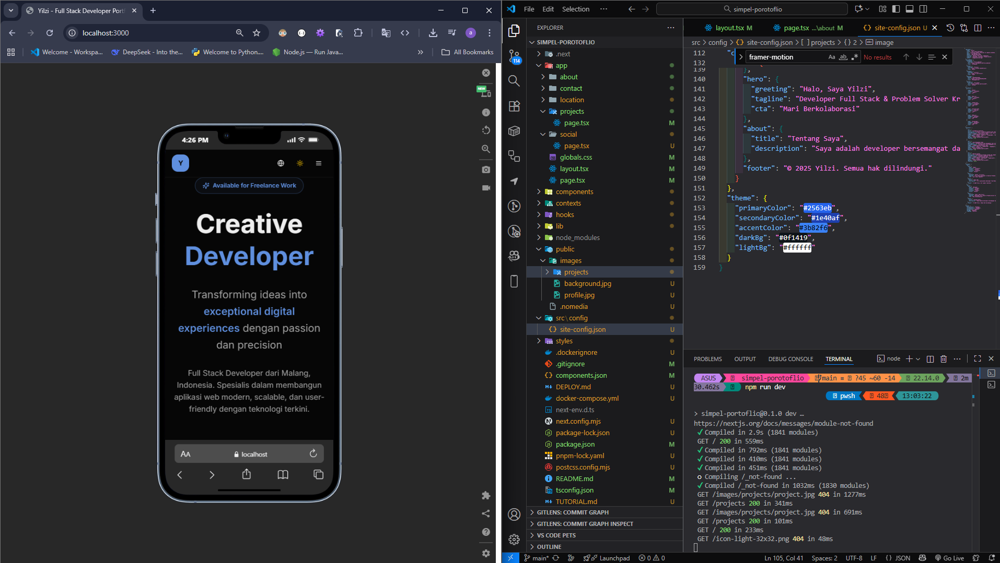

# Yilzi Portfolio Website

A modern, full-stack developer portfolio built with Next.js, React, TypeScript, and Tailwind CSS.

## Features

- 🌙 **Dark/Light Mode Toggle** - Seamless theme switching with proper hydration handling
- 🌍 **Multi-language Support** - English and Indonesian translations
- 📱 **Fully Responsive** - Works perfectly on all devices
- ✨ **Smooth Animations** - Beautiful transitions and micro-interactions
- 🎨 **Modern Design** - Professional aesthetic with glassmorphism effects
- ⚡ **Performance Optimized** - Fast loading times and smooth interactions
- 🔍 **SEO Friendly** - Optimized for search engines
- 🎯 **Accessible** - WCAG compliant with proper semantic HTML

## Tech Stack

- **Framework**: Next.js 15+ with App Router
- **Language**: TypeScript
- **Styling**: Tailwind CSS v4
- **UI Components**: Shadcn/ui
- **Theme**: next-themes with system preference detection
- **Icons**: Lucide React
- **Animations**: Custom CSS animations

## Getting Started

### Prerequisites

- Node.js 18+ or higher
- npm or yarn package manager

### Installation

1. Clone the repository:
\`\`\`bash
git clone <repository-url>
cd portfolio
\`\`\`

2. Install dependencies:
\`\`\`bash
npm install
\`\`\`

3. Run the development server:
\`\`\`bash
npm run dev
\`\`\`

4. Open [http://localhost:3000](http://localhost:3000) in your browser.

## Project Structure

\`\`\`
.
├── app/
│   ├── layout.tsx           # Root layout with theme provider
│   ├── page.tsx             # Home page
│   ├── about/page.tsx       # About page
│   ├── projects/page.tsx    # Projects page
│   ├── contact/page.tsx     # Contact page
│   ├── location/page.tsx    # Location page
│   ├── social/page.tsx      # Social links page
│   └── globals.css          # Global styles and animations
├── components/
│   ├── navbar.tsx           # Navigation bar with theme toggle
│   ├── footer.tsx           # Footer component
│   ├── hero-section.tsx     # Hero section with CTA
│   ├── tech-stack.tsx       # Tech stack showcase
│   ├── theme-provider.tsx   # Next-themes wrapper
│   └── ui/                  # Shadcn/ui components
├── contexts/
│   └── language-context.tsx # i18n context with translations
├── lib/
│   └── site-config.ts       # Site configuration import
├── public/
│   ├── icon-light-32x32.png # Light theme favicon
│   └── icon-dark-32x32.png  # Dark theme favicon
└── src/
    └── config/
        └── site-config.json # Centralized configuration
\`\`\`

## Configuration

Edit `src/config/site-config.json` to customize:
- Personal information
- Social media links
- Projects
- Technology stack
- Contact information

Example:
\`\`\`json
{
  "personal": {
    "name": "Yilzi",
    "title": "Full Stack Developer",
    "location": "Malang, Indonesia"
  },
  "social": [
    {
      "name": "GitHub",
      "url": "https://github.com/yilzi",
      "icon": "📱"
    }
  ],
  "projects": [
    {
      "title": "Project Name",
      "description": "Project description",
      "technologies": ["React", "Next.js", "TypeScript"],
      "featured": true,
      "demo": "https://demo.com",
      "source": "https://github.com/..."
    }
  ]
}
\`\`\`

## Customization

### Changing Colors

Edit the color scheme in `app/globals.css`:

\`\`\`css
:root {
  --primary: oklch(0.35 0.15 260);      /* Deep Blue */
  --secondary: oklch(0.75 0.12 260);    /* Light Blue */
  --accent: oklch(0.55 0.16 260);       /* Accent Blue */
}
\`\`\`

### Adding New Pages

1. Create a new folder in `app/` with a `page.tsx` file
2. Import Navbar and Footer components
3. The page will automatically be routed

### Updating Translations

Add new translation keys in `contexts/language-context.tsx`:

\`\`\`typescript
const translations: Record<Language, Record<string, string>> = {
  en: {
    "key.name": "English text"
  },
  id: {
    "key.name": "Indonesian text"
  }
}
\`\`\`

## Deployment

### Deploy to Vercel (Recommended)

1. Push your repository to GitHub
2. Import the repository in [Vercel](https://vercel.com)
3. Vercel will automatically detect Next.js and configure the build
4. Click Deploy

### Deploy to Other Platforms

\`\`\`bash
npm run build
npm start
\`\`\`

The `out` directory contains the production build.

## Environment Variables

No environment variables are required for basic functionality. The site is fully static.

## Performance

- Optimized images with next/image
- CSS-in-JS with Tailwind CSS
- Efficient animations using CSS keyframes
- Code splitting and lazy loading
- Minified production builds

## Browser Support

- Chrome (latest)
- Firefox (latest)
- Safari (latest)
- Edge (latest)

## Troubleshooting

### Dark Mode Not Toggling

Ensure `suppressHydrationWarning` is set on the `<html>` tag in `app/layout.tsx`.

### Animations Not Smooth

Check that Tailwind CSS v4 is installed and the animation utilities are properly configured in `globals.css`.

### Theme Not Persisting

The theme preference is stored in localStorage via `next-themes`. Ensure localStorage is enabled in your browser.

## Contributing

Feel free to fork this repository and use it as a template for your own portfolio!

## License

MIT License - feel free to use this project for personal or commercial purposes.

## Contact

- Email: yilzi@owner.com
- GitHub: [@yilzi](https://github.com/yilzi)
- Twitter: [@yilzi](https://twitter.com/yilzi)

---

Built with ❤️ by Yilzi